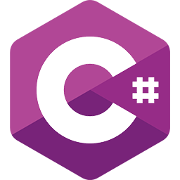
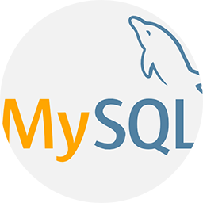
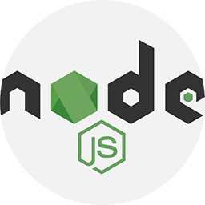
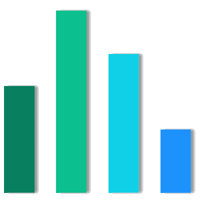

    

# Hello, `<Developers/>`! 

    I'm Karan Jaiswal, a scholar, programmer who wants to work in new technologies. I'm a computer geek, who is keenly interested in computers & software applications.
    Thank You for visiting my GitHub Profile! :smile:

# About Me 

- 🎓 I'm a student of Pondicherry University.

- 👀 I’m interested in problem solving.

- 🔭 I’m currently working on an Android Project.

- 🌱 I’m currently learning Data Structures & Algorithms.

- 👯 I’m looking to collaborate in an Open-Source Projects.

- 💬 Talk to me about Projects, Freelancing Opportunites, Open-Source Collaborations.

# Skills 

    <!--  -->
    
    
    
    
    
    <!--  -->
    
    
    <!--  -->
    <!--  -->
    
    <!--  -->
    
    
    <!--  -->
    

# Connect with Me 

    
    
    
    
    

# My Github Statistics 

<table align="center">
    <tr>
        <td>
            
        </td>
        <td>
            
        </td>
    </tr>
    <tr>
        <td>
            
        </td>
        <td>
            
        </td>
    </tr>
</table>
