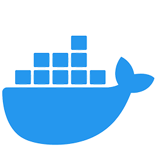
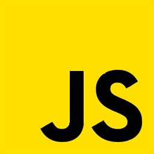
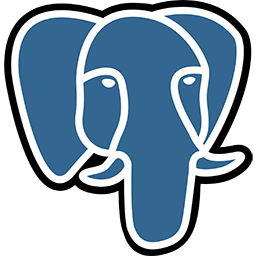

    

# Hello, `<Developers/>`! 

    I'm Karan Jaiswal, a scholar, programmer who wants to work in new technologies. I'm a computer geek, who is keenly interested in computers & software applications.
    Thank You for visiting my GitHub Profile! :smile:

# About Me 

-   🎓 Graduated from Pondicherry University.

-   👀 Interested in problem solving.

-   🔭 Currently working as a Full-Stack Developer.

-   🌱 In love with Data Structures & Algorithms.

-   👯 Looking to collaborate in an Open-Source Projects.

-   💬 Talk to me about Projects, Freelancing Opportunites, Open-Source Collaborations.

# Skills 

    
    
    
    
    
    
    
    
    
    
    
    
    
    
    
    
    
    
    

# Connect with Me 

    
    
    
    
    

# My Github Statistics 

<table align="center">
    <tr>
        <td>
            
        </td>
        <td>
            
        </td>
    </tr>
    <tr>
        <td>
            
        </td>
        <td>
            
        </td>
    </tr>
</table>
